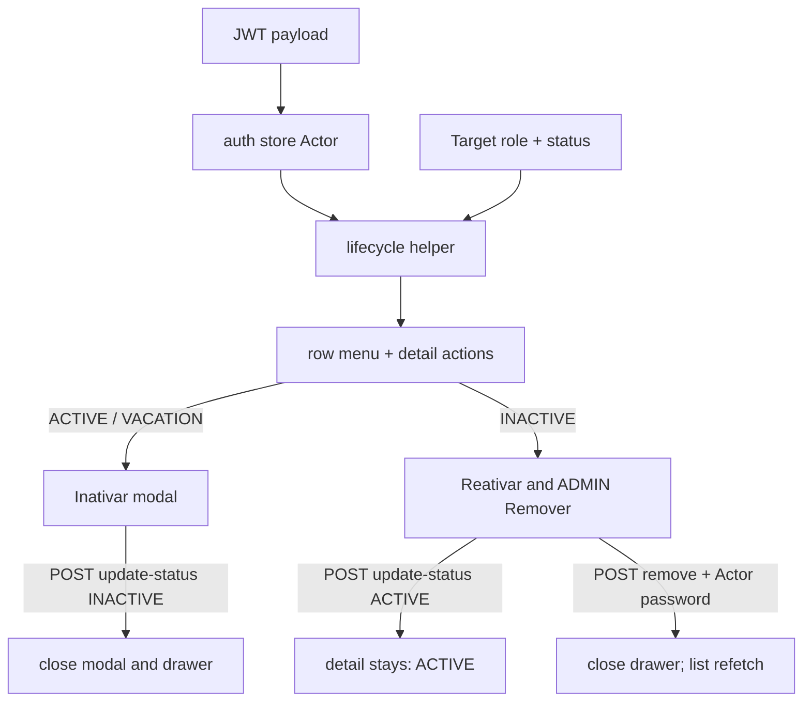

# Design Doc: Employee Lifecycle (frontend v1)

**Status:** Draft — Vue shape  
**Date:** 24/08/2026  
**PRD:** [`docs/prd/employee-lifecycle-v1.md`](../prd/employee-lifecycle-v1.md)  
**Glossary:** [`CONTEXT.md`](../../CONTEXT.md)  
**Constitution:** [`AGENTS.md`](../../AGENTS.md)  
**API (shipped):** `grau-api` `docs/design-docs/employee-lifecycle-v1.md` · ADRs `docs/adr/remove-or-inactivate-emp/`  
**Specs (frontend slices):** [`docs/specs/employee-lifecycle-v1/`](../specs/employee-lifecycle-v1/README.md)  
**Jira (API):** [KAN-1](https://paulodevmais.atlassian.net/browse/KAN-1) Done · [KAN-2](https://paulodevmais.atlassian.net/browse/KAN-2)–[KAN-6](https://paulodevmais.atlassian.net/browse/KAN-6) In Review + QA · [KAN-7](https://paulodevmais.atlassian.net/browse/KAN-7) QA P0 (9/9 pass after restart)  
**Jira (this app):** [KAN-8](https://paulodevmais.atlassian.net/browse/KAN-8)–[KAN-13](https://paulodevmais.atlassian.net/browse/KAN-13) Prioritized — one card per slice of §14

This document closes **where** Deactivate / Reactivate / Remove live in `grau-frontend`, **which actions** the operator sees, and **how** the app calls the API that already shipped. It does **not** re-specify Anonymize, Last Admin counting, or the hexagon. Product ADRs stay in `grau-api`.

---

## 1. Problem

The PRD already defines **what** must happen. The Vue app today does **not**:

1. Know the **Actor**. `useAuthStore` persists only `token`. Role — the switch that shows or hides operator actions — is never read.
2. Distinguish **Deactivate** from **Remove**. The overflow menu label is “Remover”; it opens `InactivateModal`. That modal offers Remove via “clique aqui” on **any** status, including `ACTIVE`.
3. Call `POST /api/employee/update-status` or `POST /api/employee/remove`. Inactivate is `console.log`.
4. Show the **INACTIVE fork**. There is no Reactivate. After a would-be Deactivate, the operator is not left on the Target’s profile.
5. Mirror the authority matrix. MANAGER and EMPLOYEE see the same trash control as ADMIN.

The API already enforces the matrix (`403`), Last Admin (`409`), and step-up (`401`). Complexity of invariants stays there. This app owns **visibility**, **copy**, and **the two surfaces**.

---

## 2. Objectives and non-goals

### Objectives v1

- Persist Actor `id` + `role` (+ `status`) from the JWT. Role drives which actions are visible.
- One helper `canDeactivate` / `canReactivate` / `canRemove(Actor, Target)`. No ad-hoc `if`s in views.
- Two surfaces: Deactivate only on `ACTIVE` / `VACATION`; Reactivate (and ADMIN Remove) only on `INACTIVE`. Kill the Inactivate-then-Remove shortcut.
- Portuguese labels aligned with the glossary: **Inativar** / **Reativar** / **Remover**. Never label Deactivate as “Remover”.
- HTTP clients for `update-status` and `remove`. Never send `actorId`.
- After Deactivate: close the confirm modal and the drawer. Do not open the Target detail.
- After Remove: close drawer, refetch, Target gone. Toast that the original email is free for a **new** Create.
- Map `401` / `403` / `409` to operator copy. Last Admin is **not** in the helper.

### Non-goals v1

- Vacation **actions** (put on vacation / leave vacation). Badge, tab and `VACATION` rows stay. Deactivate is the only lifecycle action on `VACATION`.
- Audit UI / `?status=REMOVED`.
- `GET /me`. Role comes from the JWT this version.
- Permission catalog / ACL. Role is the only visibility switch.
- Server-side JWT revocation / re-check of Actor status in Auth. Client session drop on Self-Deactivate is in-scope (§9.5).
- Create-employee authorization matrix.
- Hard delete, payroll, commissions, downstream `REMOVED` behaviour.
- Counting Last Admin on the client.

---

## 3. Language

Use [`CONTEXT.md`](../../CONTEXT.md). Do not invent parallel terms.

| Term | In this app |
|------|-------------|
| Deactivate / Reactivate / Remove / Anonymize / Actor / Target / Removed / Last Admin / Role / INACTIVE fork | [`CONTEXT.md`](../../CONTEXT.md) |
| Inativar / Reativar / Remover | Portuguese **labels** for those terms. Code and helpers stay in English. |
| `EmployeeShapped.permission` | The Target’s **Role** on the list today. Treat as Role. Do not introduce a second permission type. Rename is optional and not required to ship this feature. |

`VACATION` is a list status, not a command in this slice.

---

## 4. Forms considered

### Where the Actor’s Role comes from

| | A — Decode JWT into the auth store | B — Wait for `GET /me` | C — Show every action, rely on HTTP errors |
|--|------------------------------------|------------------------|--------------------------------------------|
| This v1 | Token already exists; payload has `id`, `role`, `status` | Blocks on an Auth endpoint this PRD does not own | MANAGER sees Remover and eats `403` |
| Trust | Client Role is UX only; API still stamps Actor from JWT | Same | Same |

**Chosen: A.** Role is the determining factor for which operator actions are visible. Decode on login and on a persisted token. Still handle `401` / `403` / `409`. Never send `actorId`.

### Where the INACTIVE fork lives

| | A — Two surfaces | B — “clique aqui” on the Inactivate modal |
|--|------------------|-------------------------------------------|
| Accidents | Remove only after an explicit operational stop | Remove offered from `ACTIVE` |
| PRD 2.2 | Matches | Contradicts |

**Chosen: A.**

### How much matrix the UI mirrors

| | A — Helper(Actor role, Target role + status) | B — Actor role only | C — Nothing (errors only) |
|--|-----------------------------------------------|---------------------|---------------------------|
| MANAGER vs ADMIN row | Hides Deactivate on MANAGER/ADMIN | Still shows it → `403` | Always `403` |
| Last Admin | Cannot know count from the list → still `409` | Same | Same |

**Chosen: A**, with Last Admin **out** of the helper.

### After Deactivate / after Remove

| | After Deactivate | After Remove |
|--|------------------|--------------|
| A (chosen) | Close confirm modal **and** the drawer. Do not open the Target detail. Do not switch the list tab. List refetches. | Close drawer + modal. Refetch. Target gone. Toast: left the team; email free for a **new** Create. |
| Rejected | Keep or open detail as the fork after success / switch to Inativos | Keep a Removed profile (sentinels — PRD forbids) |

After Reactivate: stay on the same detail, now `ACTIVE` (symmetric to Deactivate).

---

## 5. Decision of form (v1)

```text
auth store                 → token + actor { id, role, status } from JWT payload
employee lifecycle helper  → canDeactivate / canReactivate / canRemove(actor, target)
HttpEmployeesApi           → updateStatus + remove  (Bearer only; no actorId)
Employees.vue              → menus/detail ask the helper; two modals; two surfaces
detail snapshot            → open profile is not keyed only off the current list page
```



Do **not** put the matrix only in Vue. Do **not** call Axios from the view.

---

## 6. As-is vs to-be (this app)

| Surface | Today | v1 |
|---------|--------|----|
| `useAuthStore` | `token` only | `token` + Actor `id`, `role`, `status` |
| Overflow menu | Editar + **Remover** → Inactivate modal | Helper: Inativar **or** Reativar **or** Remover. Never both Inativar and Remover. |
| `InactivateModal` | Inativar copy + “clique aqui” to Remove | Confirm Deactivate only. No Remove link. |
| Remove | Same drawer mode, no password, no HTTP | Own modal: Actor password, PRD copy, `POST /remove` |
| Reactivate | missing | Visible on `INACTIVE` when helper allows; `status: ACTIVE` |
| Detail trash | always “Eliminar” → inactivate | Same helper as the menu |
| `HttpEmployeesApi` | `getEmployees` only | + `updateStatus` + `remove` |
| After Inativar | `console.log` | Close modal and drawer |
| `REMOVED` in filters | not present | keep absent (`400` if ever sent) |

---

## 7. Session (Actor)

JWT from `POST /auth` (sample in `grau-api` `employee.http`) includes `id`, `name`, `email`, `role`, `status`.

On `setSession` and when hydrating a persisted token:

1. Decode the payload (base64url). Do **not** verify the signature on the client.
2. Store `id`, `role` (`EMPLOYEE` \| `MANAGER` \| `ADMIN`), `status`.
3. If the payload is missing `role`, treat as no lifecycle actions (helper returns false). Do not guess `ADMIN`.

Router guard stays “has token”. Actor `status !== ACTIVE` still has a token until Auth re-checks; the API returns `401` on lifecycle commands. No extra client lockout this version.

Never persist the Actor password.

---

## 8. Visibility helper

Pure functions. Actor from the store; Target from the row/profile.

```ts
canDeactivate(actor, target)  // Target ACTIVE | VACATION
canReactivate(actor, target)  // Target INACTIVE
canRemove(actor, target)      // Target INACTIVE and Actor ADMIN
```

Rules (mirror PRD 2.4, not Last Admin):

| Actor.role | Target.role | `ACTIVE` / `VACATION` | `INACTIVE` |
|------------|-------------|------------------------|------------|
| `EMPLOYEE` | any | none | none |
| `MANAGER` | `EMPLOYEE` | Inativar | Reativar |
| `MANAGER` | `MANAGER` / `ADMIN` | none | none |
| `ADMIN` | any | Inativar | Reativar + Remover |

Also hide when `actor.id === target.id` **and** the intent is Remove (belt-and-braces; statuses already differ). Self-Deactivate may still show for a non-Last-Admin ADMIN; `409` handles Last Admin.

Views, overflow menu, and `EmployeeDetailPanel` **only** call these helpers. Do not duplicate the table in the template.

---

## 9. Screens and copy

Locale: `pt`. Canonical terms stay English in code.

### 9.1 Row menu and detail header

Show only the actions the helper allows (plus Editar, which this slice does not change).

| Action | Label | Opens |
|--------|--------|--------|
| Deactivate | Inativar | Confirm modal (no password) |
| Reactivate | Reativar | No extra modal — `update-status` `{ status: "ACTIVE" }` (optional confirm is **not** required; keep one click unless implementation prefers a light confirm) |
| Remove | Remover | Step-up modal (Actor password) |

Reactivate is operational restore of the same identity, not irreversible. **Chosen:** one click from menu/detail, no password. Destructive confirm stays on Inativar and Remover only.

### 9.2 Deactivate confirm

Reuse `ModalLayout`. Body: Inativar is operational stop; they stay on the list; original email stays occupied; they can be Reativados. Primary: **Inativar**. No “clique aqui” to Remove. No password.

When Target === Actor, the modal uses **distinct copy**: the operator is inactivating their own account, they will be disconnected, and they cannot Reactivate themselves. Primary stays **Inativar**.

### 9.3 Remove step-up

Own modal (do not reuse the Inativar body with a mode flag that still smells like the shortcut). Fields: **one** password — Actor. Reuse `PasswordRevealler`. No `passwordConfirmation`. No typing the Target’s name.

Copy (PRD 2.6): irreversible; desaparece da lista; o email original fica livre; um cadastro posterior com esse email é uma **nova** identidade e não herda o histórico do id `REMOVED`.

Primary: **Remover**. Wrong password: same opacity as login (`Authentication failed` → copy already used on Login). Stay on the modal.

### 9.4 Toasts

| Event | Copy intent |
|-------|-------------|
| Deactivate OK | Colaborador inativado. Você pode reativá-lo pelo perfil. |
| Reactivate OK | Colaborador reativado (mesma identidade). |
| Remove OK | Saiu da equipe. Email original livre para um cadastro **novo**. |
| Last Admin `409` | É preciso existir outro Administrador ativo antes desta ação. Modal stays open. |
| `403` | Should be rare if the helper is correct. Generic: ação não permitida. Hide the action on next render. |
| `401` on Remove | Opaque credentials failure on the modal. No persist. |
| Self-Deactivate `200` | **No toast.** Session drop + redirect (§9.5). |

### 9.5 Self-Deactivate (client session)

On Deactivate `200`, if Target === Actor:

1. Do **not** push the generic success toast (“você pode reativá-lo pelo perfil”). `ToastHost` lives in `AppContainer` and would vanish on redirect anyway; the redirect is silent.
2. The composable calls `onSelfDeactivated(result)` instead of `onStatusChanged`.
3. The view runs `authStore.logout()` (clears `token` + `localStorage` `auth`) and `router.push('/login')`.
4. `closeDrawer()` is skipped — the `/app` shell unmounts.

Only on `200`. Last Admin `409` is unchanged: Last Admin copy, modal stays open, session kept. The API does not revoke JWTs; this is a client-side compensation.

---

## 10. HTTP (client contract)

All routes: `Authorization: Bearer <token>` via the existing Axios interceptor. Envelope: success unwrapped by `api` interceptor (`response.data` is the inner payload). Errors: `error.response.data.error` (string).

```http
POST /api/employee/update-status
{ "id": "<Target>", "status": "INACTIVE" | "ACTIVE" | "VACATION" }
```

This slice sends `INACTIVE` (Deactivate) and `ACTIVE` (Reactivate) only. Do not send `VACATION`. Do not send `REMOVED`. Do not send `actorId`.

Success: `200` `{ id, status }` (after unwrap).

```http
POST /api/employee/remove
{ "id": "<Target>", "password": "<Actor password>" }
```

Success: `200` `{ id }`.

```http
GET /api/employees?status=ACTIVE|INACTIVE|VACATION&...
```

Already excludes `REMOVED`. Do not add a Removed filter.

Extend `HttpEmployeesApi` / `GetEmployeesApi` into an employees port that includes writes, or add `UpdateEmployeeStatusApi` + `RemoveEmployeeApi` next to it. Views still talk to a composable, not Axios.

| Result | Status | Operator |
|--------|--------|----------|
| update-status OK | `200` | Deactivate: close modal and drawer. Reactivate: stay on detail; set snapshot status from body |
| remove OK | `200` | Close drawer; invalidate `['employees', …]` |
| missing / invalid / not found / already-in-status | `400` | Inline/toast `{ error }` |
| Actor password / Actor not usable | `401` | Opaque; Remove modal stays open |
| Matrix | `403` | “Ação não permitida”; helper should have hidden this |
| Last Admin / not `INACTIVE` / already Removed | `409` | Last Admin copy when message matches; otherwise keep profile and show `{ error }` |

Exact API strings (do not depend on Portuguese from the server):

- `401` → `Authentication failed`
- `403` → `Action not allowed`
- `409` Last Admin → `Last Admin must stay ACTIVE until another Admin exists`
- `409` Remove not inactive → `Employee is not inactive`
- `409` already removed → `Employee is already removed`

Branch on **HTTP status first**, then on the English `error` string for `409`.

---

## 11. Detail snapshot

Today `detailEmployee` is `employees.find(id)`. After a status change that drops the row from the current tab (Reactivate on Inativos, or a still-open profile whose row left the page), that find misses.

**Chosen:** while a profile stays open, the drawer keeps a **Target snapshot** (last shaped employee + `status` from the mutation). The open profile reads the snapshot, not only the current page. List query still refetches. If the id is no longer in the list, the drawer stays open until the operator closes it or Remove succeeds.

After Deactivate: drop the snapshot and `closeDrawer()` — do not keep the fork open.
Remove: drop the snapshot and `closeDrawer()`.
Reactivate: keep the snapshot and stay on detail.

---

## 12. Wiring (composables)

Follow [`AGENTS.md`](../../AGENTS.md). Suggested split:

| Module | Owns |
|--------|------|
| `useAuthStore` | token + Actor from JWT |
| `employee-lifecycle.ts` (pure helper) | `canDeactivate` / `canReactivate` / `canRemove` |
| `HttpEmployeesApi` | `updateStatus`, `remove` |
| `useEmployeeLifecycle` | mutations, error map, snapshot status, toasts. Exposes `onSelfDeactivated`; receives `getActorId` so the Actor identity is injectable in tests. |
| `useEmployeeDrawer` | modes: `detail` \| `create` \| `edit` \| `inactivate` \| `remove` — Remove is **not** a child of Inactivate |
| `Employees.vue` / detail / menu | ask helper; open the right modal. On Self-Deactivate: `authStore.logout()` + `router.push('/login')`. |

`useMutation` `retry: 0`. On success, `queryClient.invalidateQueries({ queryKey: ['employees'] })` (or `refetch`).

---

## 13. Sequences

**Deactivate**

```text
Actor clicks Inativar (helper true)
  → confirm modal
  → POST /api/employee/update-status { id, status: INACTIVE }
  → 200 { id, status: INACTIVE }
  → close confirm and drawer; drop snapshot
  → invalidate employees
  → toast (generic)
```

**Self-Deactivate**

```text
Actor clicks Inativar on their own row (helper true; Target === Actor)
  → confirm modal (distinct copy: disconnected, cannot self-reactivate)
  → POST /api/employee/update-status { id, status: INACTIVE }
  → 200 { id, status: INACTIVE }
  → invalidate employees
  → no toast
  → onSelfDeactivated → logout + router.push('/login')
  → 409 Last Admin: toast Last Admin copy; modal stays; session kept
```

**Reactivate**

```text
Actor clicks Reativar
  → POST /api/employee/update-status { id, status: ACTIVE }
  → 200 { id, status: ACTIVE }
  → patch snapshot; stay on detail
  → invalidate employees
```

**Remove**

```text
Actor clicks Remover (helper true)
  → password modal
  → POST /api/employee/remove { id, password }
  → 200 { id }
  → close modal + drawer; drop snapshot; toast; invalidate employees
  → 401: stay on modal, opaque error
  → 409 Last Admin: stay on profile, Last Admin copy
```

---

## 14. Implementation slices (frontend playbook)

Each slice has a spec under [`docs/specs/employee-lifecycle-v1/`](../specs/employee-lifecycle-v1/README.md) — files touched, contracts, and observable acceptance criteria — and a card on Grau System Board.

| Slice | What ships | Spec | Jira |
|-------|------------|------|------|
| 0 | JWT → auth store (`id`, `role`, `status`) | [`slice-0-actor-from-jwt.md`](../specs/employee-lifecycle-v1/slice-0-actor-from-jwt.md) | [KAN-8](https://paulodevmais.atlassian.net/browse/KAN-8) |
| 1 | HTTP `updateStatus` + `remove` on the employees port | [`slice-1-http-lifecycle-commands.md`](../specs/employee-lifecycle-v1/slice-1-http-lifecycle-commands.md) | [KAN-9](https://paulodevmais.atlassian.net/browse/KAN-9) |
| 2 | Pure helper + wire menus/detail (labels Inativar / Reativar / Remover; kill “clique aqui”) | [`slice-2-visibility-helper.md`](../specs/employee-lifecycle-v1/slice-2-visibility-helper.md) | [KAN-10](https://paulodevmais.atlassian.net/browse/KAN-10) |
| 3 | Deactivate confirm + mutation + close drawer | [`slice-3-deactivate.md`](../specs/employee-lifecycle-v1/slice-3-deactivate.md) | [KAN-11](https://paulodevmais.atlassian.net/browse/KAN-11) |
| 4 | Reactivate mutation + stay on detail | [`slice-4-reactivate.md`](../specs/employee-lifecycle-v1/slice-4-reactivate.md) | [KAN-12](https://paulodevmais.atlassian.net/browse/KAN-12) |
| 5 | Remove modal (Actor password) + mutation + close/toast + `401`/`409` | [`slice-5-remove.md`](../specs/employee-lifecycle-v1/slice-5-remove.md) | [KAN-13](https://paulodevmais.atlassian.net/browse/KAN-13) |
| 6 | Self-Deactivate: drop client session + silent redirect to `/login` | [`slice-6-self-deactivate-logout.md`](../specs/employee-lifecycle-v1/slice-6-self-deactivate-logout.md) | a definir |

Do not implement Vacation actions. Do not call `status: REMOVED`. Do not send `actorId`.

Shape calls the specs had to settle, binding for the slices above: pure framework-free modules live in a new `src/domain/`; the Actor is a `computed` over the persisted token rather than a second persisted key; the toast primitive §9.4 assumes does not exist yet and ships with slice 3; `InactivateModal.vue` keeps its filename and loses the Remove link instead of being renamed.

---

## 15. Interview notes (frontend grilling)

Product rules live in the PRD. These were **shape** decisions (24/08/2026):

- **PRD references this repo** — glossary `CONTEXT.md`, constitution `AGENTS.md`, this design doc. API ADRs and hexagon stay in `grau-api` (KAN-1 … KAN-6).
- **Two surfaces, no shortcut** — Remove only from the INACTIVE fork. Current “Remover” menu + “clique aqui” is wrong.
- **Role from JWT** — determining factor for visible actions. No permission catalog, no `/me` this version.
- **Helper(Actor, Target)** — EMPLOYEE sees nothing; MANAGER only `EMPLOYEE`; ADMIN sees the fork. Last Admin is `409` because the list has no ACTIVE-admin count.
- **Close the drawer after Deactivate** — the operator is not dropped onto the INACTIVE fork. They open that profile later from Inativos or Todos when they want Reactivate or Remove. After Remove, close everything so sentinels never render.
- **Vacation actions out** — status remains on the list; Deactivate is the only lifecycle control on `VACATION`.

---

## 16. Acceptance mapping (frontend)

Mirrors PRD §7 at the Vue boundary (API already covered by KAN-7):

- [x] MANAGER + `INACTIVE` `EMPLOYEE` → Reativar visible and succeeds; Remover hidden; `POST /remove` not offered.
- [ ] ADMIN + `INACTIVE` `EMPLOYEE` + correct Actor password → Remove; row gone; toast about new Create; original email usable on Create as a new id (API).
- [ ] ADMIN + wrong password → `401`; modal stays; no list change.
- [ ] `ACTIVE` / `VACATION` → Remover not visible. Inativar visible when helper allows.
- [ ] MANAGER + Target `MANAGER` or `ADMIN` → no Inativar / Reativar / Remover.
- [ ] Last Admin + Inativar or Remover → action may show; `409` with Last Admin copy; modal stays open.
- [ ] Two ADMINs: A may Remove `INACTIVE` B; A remains in the list.
- [ ] No `actorId` in any JSON body.
- [ ] Overflow menu never uses “Remover” for Deactivate.
- [ ] After Inativar, the confirm modal and the drawer close; the list tab is unchanged.
- [ ] ADMIN Self-Deactivate `200` → no toast; token cleared; redirect to `/login`. Last Admin `409` keeps the session.
